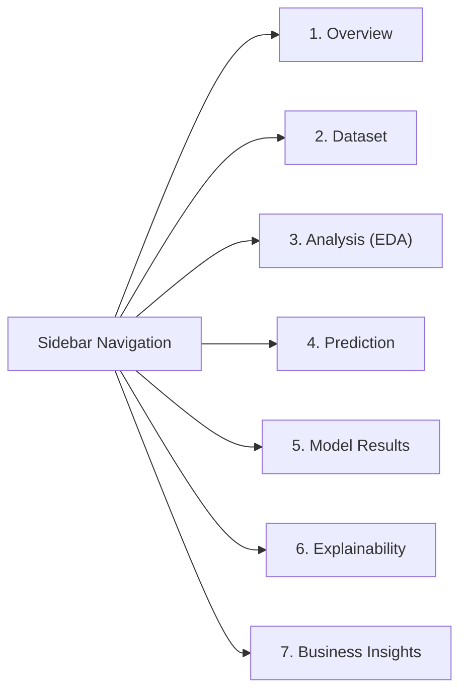

# 🛡️ Financial Fraud Detection & Explainable AI (XAI) System

An enterprise-grade, interactive **Financial Fraud Detection & Decision Governance Platform** built with **Streamlit**, **Scikit-Learn**, **SMOTE**, **SHAP**, and **LIME**. 

This system transforms static financial analytics into a dynamic, production-ready operational dashboard that addresses extreme class imbalance, prioritizes fraud sensitivity (Recall), simulates operational decision thresholds, and provides full regulatory transparency.

---

## 📌 Key Highlights

* **Algorithm:** Logistic Regression with standardized continuous features and one-hot categorical encoding.
* **Class Imbalance Handling:** Systematic evaluation of baseline imbalanced data vs. **SMOTE** (Synthetic Minority Over-sampling Technique) across multiple train-test splits.
* **Champion Model:** **Case 3 (SMOTE Balanced + 55:45 Split)** achieving **79.31% Recall**, **0.6216 F1-Score**, and **0.9303 ROC-AUC**.
* **Dual-Layer Explainability:** **SHAP** (global feature importance & beeswarm attribution) and **LIME** (case-by-case auditability for compliance with Federal Reserve **SR 11-7** model risk management guidance).
* **Operational Threshold Tuner:** Interactive cutoff slider ($\tau \in [0.10, 0.90]$) for risk-tiered fraud policies.
* **High-Contrast Dark Theme:** FinTech-tailored glassmorphism UI designed for maximum readability and visual appeal.

---

## 🏗️ Application Architecture & Navigation

The platform is structured into 7 modular, independently expandable sections:



| Section | Description |
| :--- | :--- |
| **1. Overview** | Executive summary scorecards (1,000 transactions, 6.4% fraud rate, 14.6:1 imbalance ratio), problem context, and pipeline architecture. |
| **2. Dataset** | Data hygiene verification (0 nulls, 0 duplicates), interactive record browser, 5-number statistical summaries, and preprocessing specs. |
| **3. Analysis** | Comprehensive EDA: target class imbalance, KDE distribution histograms, IQR outlier boxplots, categorical cross-tabs, and correlation heatmap. |
| **4. Prediction** | Live transaction scoring engine: input transaction parameters, adjust decision threshold ($\tau$), and view real-time fraud probability with risk gauge. |
| **5. Model Results** | Side-by-side benchmarking of all 4 modeling cases, comparative bar charts, superimposed ROC curves, confusion matrices, and threshold tuning. |
| **6. Explainability** | Standardized Logistic Regression weights, SHAP global feature importances, and local LIME case audits for individual transactions. |
| **7. Business Insights** | Executive answers to banking error costs, Precision-Recall trade-offs, fraud behavioral profiles, and regulatory compliance. |

---

## 📊 Dataset Overview

* **Source File:** `fraud_dataset.csv`
* **Dimensions:** 1,000 records × 8 raw attributes
* **Target Variable:** `is_fraud` (0 = Legitimate [93.6%], 1 = Fraud [6.4%])
* **Feature Schema:**
  * `amount`: Transaction amount in USD ($0.46 to $817.24, mean $97.25).
  * `account_age_days`: Age of the user account in days (2 to 1,998 days).
  * `num_prev_transactions`: Historical transaction count (0 to 499).
  * `location_risk`: Categorical ordinal risk rating (`low`, `medium`, `high`).
  * `transaction_type`: Payment category (`cash_out`, `debit`, `payment`, `transfer`).
  * `device_type`: Originating hardware (`desktop`, `mobile`, `tablet`).
  * `transaction_id`: Identifier dropped to avoid predictive bias.

---

## ⚖️ Model Benchmarking (4 Experimental Cases)

| Metric | Case 1: Baseline (80:20) | Case 2: SMOTE (50:50) | Case 3: SMOTE (55:45) ⭐ | Case 4: SMOTE (45:55) |
| :--- | :---: | :---: | :---: | :---: |
| **Accuracy** | 94.50% | 93.60% | **93.78%** | 92.55% |
| **Precision** | 66.67% | 50.00% | **51.11%** | 45.00% |
| **Recall (Sensitivity)** | 30.77% | 78.12% | **79.31%** | 77.14% |
| **F1-Score** | 0.4211 | 0.6098 | **0.6216** | 0.5684 |
| **ROC-AUC** | 0.8091 | 0.9229 | **0.9303** | 0.9174 |
| **False Alarms (FP)** | 2 | 25 | 22 | 33 |
| **Missed Fraud (FN)** | **9 (Critical Loss)** | 7 | **6 (Lowest Loss)** | 8 |

> **Key Finding:** In Case 1, a naive baseline yields 94.5% accuracy but misses **69.2% of actual fraud attacks**. Applying SMOTE (Case 3) increases Recall from **30.77% to 79.31%**, preventing substantial financial loss.

---

## 🎚️ Operational Decision Thresholds (Case 3)

| Threshold ($\tau$) | Precision | Recall | F1-Score | FP | FN | Recommended Operational Policy |
| :---: | :---: | :---: | :---: | :---: | :---: | :--- |
| **0.20** | 0.3200 | **0.8276** | 0.4615 | 51 | **5** | **High-Value Wire Transfers (> $200):** Maximize Recall. |
| **0.30** | 0.3692 | **0.8276** | 0.5106 | 41 | **5** | **Escalated Risk Accounts:** Strict monitoring. |
| **0.50** | 0.5111 | 0.7931 | 0.6216 | 22 | 6 | **Standard Operations:** Balanced baseline. |
| **0.70** | 0.6216 | 0.7931 | 0.6970 | 14 | 6 | **Verified Low-Risk Users:** Reduced customer friction. |
| **0.80** | **0.6774** | 0.7241 | **0.7000** | **10** | 8 | **Micropayments (< $20):** Maximize Precision. |

---

## 🧠 Explainable AI (XAI) & Feature Importance

* **Top 3 Features:** LR standardized coefficients and SHAP global importance show **100% agreement**:
  1. `amount`: Strong positive contributor to fraud likelihood (+2.40).
  2. `location_risk_encoded`: High-risk regions significantly elevate risk (-2.72 baseline).
  3. `num_prev_transactions`: Established transaction history acts as a protective shield (-1.07).
* **Local Auditing (LIME):** Allows fraud investigators to inspect individual decisions (e.g. Test Sample #5 False Alarm vs. Test Sample #9 Caught Fraud) with exact feature attribution weights.

---

## 🚀 Installation & Local Run

### Prerequisites
* Python 3.10+ (Recommended: Python 3.11 or 3.12/3.13)
* Windows, macOS, or Linux

### 1. Clone or Navigate to Directory
```bash
cd "e:\Triem 4\my streamlit app"
```

### 2. Install Required Dependencies
```bash
pip install -r requirements.txt
```

### 3. Launch the Application
```bash
# Standard command (if streamlit is in PATH)
streamlit run app.py

# Or via Python module (recommended on Windows)
python -m streamlit run app.py
```

### 4. Access the Dashboard
Open your browser and navigate to:
```
http://localhost:8501
```

---

## 📁 Repository Structure

```
├── app.py                   # Main Streamlit web application (7-section architecture)
├── fraud_dataset.csv        # Core banking transactions dataset (1,000 records)
├── requirements.txt         # Pinned Python package dependencies
├── README.md                # Comprehensive project documentation
├── JUYPTER NOTEBOOK.ipynb   # Original exploratory & analytical development notebook
├── streamlit.cmd            # Windows batch wrapper for local execution
├── streamlit.ps1            # PowerShell wrapper for local execution
└── .streamlit/
    └── config.toml          # Custom high-contrast FinTech dark theme configuration
```

---

## 📜 Regulatory Governance & Compliance

This platform is engineered to align with **Federal Reserve SR 11-7 / OCC 2011-12 Guidance on Model Risk Management**:
1. **Model Parsimony:** Logistic Regression coefficients provide direct log-odds interpretability.
2. **Outcome Analysis:** Complete evaluation across confusion matrices, sensitivity (Recall), and ROC-AUC.
3. **Transparent Auditing:** Dual SHAP and LIME integration guarantees human-in-the-loop explainability for flagged transactions.
